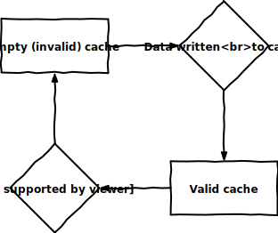

# off-by-one
**off-by-one** is a *cache invalidation algorithm*

Most cache invalidation algorithms work by applying a *caching policy* to either *purge (delete)*, *refresh (replace)* or *ban (blacklist)* content from a cache.

Caching policies vary greatly, but some common ones are:

- First in first out (FIFO)
- Last in first out (LIFO)
- Least recently used (LRU)
- Time aware least recently used (TLRU)
- Most recently used (MRU)
- Pseudo-LRU (PLRU)
- Random replacement (RR)
- Segmented LRU (SLRU)
- Least-frequently used (LFU)
- Least frequent recently used (LFRU)
- LFU with dynamic aging (LFUDA)
- Low inter-reference recency set (LIRS)
- Adaptive replacement cache (ARC)
- Clock with adaptive replacement (CAR)
- Multi queue (MQ)

(list credit <a href="https://wikipedia.org/wiki/Cache_replacement_policies">Wikipedia</a>) 

These policies each have advantages and disadvantages, but they all share one property:

***They assume that the cache was in a coherent, usable state at some point in the past***

**off-by-one** presents a new, different approach to cache invalidation through the use of a new, different caching policy; the **Most Recently Written (MRW)** policy.

This policy can be applied to any cache, to either purge, refresh or ban cached data as soon as possible after it's cached.

This policy not only ensures that the cache is invalid **at all times**, but when used to purge or replace cached data, it can in many cases lead to **significant memory savings**.

####Data Flow Diagram

This new development in cache invalidation algorithms should hopefully help to remove one of [the hardest problems](https://martinfowler.com/bliki/TwoHardThings.html) [in Computer Science](https://twitter.com/secretGeek/status/7269997868).